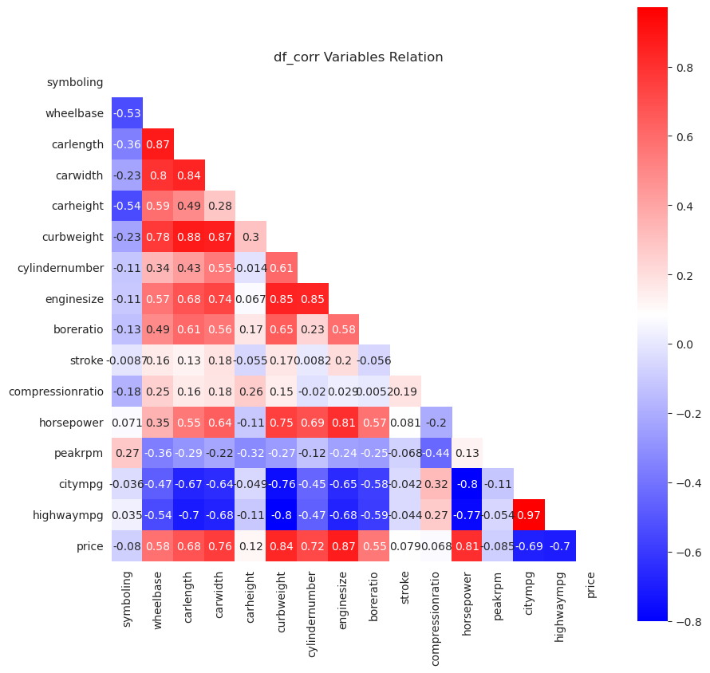

# Deep-Learning-Mindspore
 基于华为云平台的 MindSpore1.3 框架的回归任务和图像分类任务（汽车里程数预测 / 花卉图像分类 / 基于MNIST全连接网络分类的梯度下降 / 汽车产品聚类分析 / 共享单车租车量预测）

 Regression tasks and image classification tasks based on the MindSpore1.3 framework of Huawei Cloud Platform (Car mileage prediction / Flower image classification / Gradient Descent in FCN based on MNIST / Car clustering analysis / Bike sharing prediction )

 华为云平台（Huawei Cloud Platform）: https://www.huaweicloud.com/

 

#### **目录  Index**

1. [汽车里程数预测 Car Mileage Prediction](https://github.com/unicorn-yh/Deep-Learning-Mindspore#1-%E6%B1%BD%E8%BD%A6%E9%87%8C%E7%A8%8B%E6%95%B0%E9%A2%84%E6%B5%8B-car-mileage-prediction)

2. [花卉图像分类 Flower Photos Classification](https://github.com/unicorn-yh/Deep-Learning-Mindspore#2-%E8%8A%B1%E5%8D%89%E5%9B%BE%E5%83%8F%E5%88%86%E7%B1%BB-flower-photos-classification)

3. [基于MNIST全连接网络分类的梯度下降](https://github.com/unicorn-yh/Deep-Learning-Mindspore#3-%E5%9F%BA%E4%BA%8Emnist%E5%85%A8%E8%BF%9E%E6%8E%A5%E7%BD%91%E7%BB%9C%E5%88%86%E7%B1%BB%E7%9A%84%E6%A2%AF%E5%BA%A6%E4%B8%8B%E9%99%8D)

4. [汽车聚类分析 Car Clustering Analysis](https://github.com/unicorn-yh/Deep-Learning-Mindspore#4-%E6%B1%BD%E8%BD%A6%E8%81%9A%E7%B1%BB%E5%88%86%E6%9E%90-car-clustering-analysis)

5. [共享单车租车量预测 Bike Sharing Prediction](https://github.com/unicorn-yh/Deep-Learning-Mindspore#5-%E5%85%B1%E4%BA%AB%E5%8D%95%E8%BD%A6%E7%A7%9F%E8%BD%A6%E9%87%8F%E9%A2%84%E6%B5%8B-bike-sharing-prediction)

   

 

# 1. 汽车里程数预测 Car Mileage Prediction

<h4 align="center">Fig. 1: Train dataset display</h4>

 

## Aim

The main content of this project is to predict the fuel consumption mileage of the car. The frameworks used mainly include: MindSpore1.3, which is mainly used for the construction of deep learning algorithms, based on the open source auto-mpg data set, based on MindSpore1.3 deep learning The library applies a fully-connected neural network for vehicle mileage prediction. The main focus of this experiment is to distinguish the difference in network structure between classification tasks and regression tasks.

 

## Experimental design

1. **Import the modules required for the experiment:** This step is usually the first step in program editing, and import the module packages required by the experimental code with the import command. 

2. **Import the data set and preprocess:** the training of the neural network is inseparable from the data, and the data is imported here. One-hot encoding of character features in the dataset. At the same time, look at the relationship between data features. 

3. **Model building and training:** use the cell module of mindspore.nn to build a fully connected network, including an input layer, a hidden layer, and an output layer. At the same time, configure the optimizer, loss function and evaluation indicators required by the network. Pass in the data and start training the model. This experiment is a regression task, so the output of the output layer is 1-dimensional. 

4. **Check the model training status:** Use the two evaluation indicators of MAE and MSE to check the status of the model during training.

   

 

## Dataset overview

  

<h4 align="center">Fig. 2: Train dataset after discrete feature processing </h4>

 

 

<h4 align="center">Fig. 3: Visualize the correlation of data items in train dataset</h4>

 

## Result

| Model Training | Result                                                       |
| :--------------: | :------------------------------------------------------------: |
| Iteration      |  |
| Loss           |  |

<h4 align="center">Table 1: Model training result</h4>

 

| Loss Function           | Graph                                                        |
| :-----------------------: | :------------------------------------------------------------: |
| MAE loss function |  |
| MSE loss function |  |

<h4 align="center">Table 2: Loss function graph</h4>

 

It can be seen from Table 2, the model's MAE and MSE began to converge when the number of iterations reached 400, and showed a gentle trend until the follow-up. 

This project emphasized the usage of the MindSpore1.3 framework of Huawei Cloud Platform and its deep learning library to realize the regression prediction of car mileage based on the fully connected neural network. The experiment uses MAE and MSE loss functions to evaluate the performance of the regression task of the model, and from the above experimental results and analysis, it can be seen that after the model reaches a certain number of iterations, the loss value gradually converges to a fixed value, realizing the regression task.

 

# 2. 花卉图像分类 Flower Photos Classification

| Flower Photos Classification: Tulips 郁金香 |  |
| :-----------------------------------------: | ------------------------------------------------------------ |

<h4 align="center">Fig. 4: Tulips</h4>

 

## Aim

With the rapid development of electronic technology, it is more and more convenient for people to use portable digital devices (such as mobile phones, cameras, etc.) to obtain flower images, and how to automatically identify flower species has received extensive attention. Due to the complexity of the background of flowers, as well as the inter-category similarity and intra-category diversity of flowers, the traditional method of manually extracting features for image classification cannot solve the problem of flower image classification very well.

This experiment is a flower recognition experiment based on ordinary convolutional neural network and ResNet staggered network. Unlike traditional image classification methods, convolutional neural network does not need to manually extract features, and can automatically learn features containing rich semantic information according to the input image. A more comprehensive feature description of flower images can well express different categories of information of images.

 

## Experimental Design

1. Import the experimental environment; 

2. Data set acquisition and preprocessing; 

3. Construct CNN and ResNet image recognition models; 

4. Image classification model verification.

    

<h4 align="center">Fig. 5: ResNet-50 architecture</h4>

 

Analyzing from left to right, the leftmost part of Figure 6 is the step diagram of ResNet-50, which includes the convolution block (conv_block) and standard block (identity_block) modules that deepen the network depth, avoiding training calculation difficulties and network degradation. question. MindSpore has launched to support this model, so we can directly call the interface of this model, and pass in the defined hyperparameters and data when using the model.

 

Model we used: ***ResNet-50***

Source: https://gitee.com/mindspore/mindspore/blob/r1.0/model_zoo/official/cv/resnet/src/resnet.py#

 

## Result 

| CNN                                                          | ResNet-50                                                    |
| :----------------------------------------------------------: | :----------------------------------------------------------: |
|  |  |

<h4 align="center">Table 3: ResNet-50 architecture</h4>

 

From the training results in Table 3, it can be seen that the model trained by the ResNet-50 network achieved an accuracy rate of 0.98 in the flower classification task, while the model trained by a normal CNN network achieved an accuracy rate of 0.78. The epoch of both models is set to 600, and the final loss of the ResNet-50 network reaches 0.24, while the loss of the ordinary CNN network is 0.79.

It can be seen that the model performance of the ResNet-50 network is significantly better than that of ordinary CNN. This is because the staggered network overcomes the problem of "gradient disappearance" and continues to maintain low error rates and losses in deeper networks, making it possible to build thousands of Networks with up to 3 convolutional layers are possible, thus outperforming shallower networks. The deeper the level, the stronger the representation ability and the higher the classification accuracy. In addition, ResNet speeds up network performance by using Batch Normalization to adjust the input layer to solve the problem of covariate shift.

ResNet is divided into 18 layers, 34 layers, 50 layers, 101 layers, 110 layers, 152 layers, 164 layers, 1202 layers, etc., and we use the 50-layer ResNet-50. ResNet-50 uses a bottleneck design for the building blocks, the bottleneck residual block uses 1×1 convolution (called "bottleneck"), which reduces the number of parameters and matrix multiplications, and can train each layer more quickly, using Three layers stacked instead of two. ResNet uses the ReLU activation function because of its function as a regularizer, which reduces the information loss during forward propagation and backward propagation, and improves the classification performance of the model.

 

## Personal Summary

This project emphasized the usage of the MindSpore1.3 framework of Huawei Cloud Platform and its deep learning library to realize flower image classification based on ResNet-50 staggered network. From the above experimental results, it can be seen that the model trained by the ResNet network performs significantly better than ordinary CNN, and is better than ordinary CNN in terms of accuracy and loss. This stems from the fact that the former adjusts the input layer in batch normalization to solve the problem of covariate shift, and overcomes the problem of gradient disappearance, and keeps low error rate and loss in deeper networks, so its performance is better than shallow network.

 

# 3. 基于MNIST全连接网络分类的梯度下降

 

## Result

| Model Optimizer | Train Accuracy | Test Accuracy | Loss |
| :-------------------: | :------------: | :------------: | :------: |
| **Gradient Descent** | 0.9971       | 0.9812       | 0.0002 |
| **SGD**              | 0.9593       | 0.9572       | 0.0022 |
| **RMSProp**          | 0.8803       | 0.9083       | 0.0093 |
| **Adam**             | 0.9727       | 0.9692       | 0.0018 |

<h4 align="center">Table 4: Result of different optimizers upon FCN</h4>

 

|   性能指标   |                             图表                             |
| :----------: | :----------------------------------------------------------: |
| 训练集准确率 |  |
| 测试集准确率 |  |
|     损失     |  |

<h4 align="center">Table 5: Visualizing result</h4>

 

# 4. 汽车聚类分析 Car Clustering Analysis

<h4 align="center">Fig. 6: Car Product Dataset</h4>

***Source:** https://www.kaggle.com/datasets/ngawangchoeda/car-price-dataset?resource=download*

 

## Data Preprocessing

| No   | 数据预处理步骤                                               | 结果                                                         |
| :----: | :------------------------------------------------------------: | :------------------------------------------------------------: |
| 1    | 分析非数值型数据 Analyzing non-numeric data                  |  |
| 2    | 修改品牌名称的不规则命名 Modifying the irregular naming of the brand name |  |
| 3    | 根据德国标准将汽车大小分为6类 Classification of car sizes into 6 classes according to German standards |  |
| 4    | 剔除相关性高的变量 Eliminating highly correlated variables   |  |
| 5    | 对离散型特征使用 One-Hot 编码                                |  |
| 6    | 归一化数据集                                                 |  |
| 7    | 利用 PCA 对高维数据进行降维                                  |  |

<h4 align="center">Table 6: Data Preprocessing</h4>

 

## Result

K-Means 和 K-Mediods 对比：

|                           K-Means                            |                          K-Mediods                           |
| :----------------------------------------------------------: | :----------------------------------------------------------: |
|  |  |

<h4 align="center">Table 7: Comparison between K-Means and K-Mediods</h4>

 

Agglomerative Clustering 对比：

| **Single Linkage** | **** |
| :--------------------: | ------------------------------------------------------------ |
| **Complete Linkage** | **** |
| **Average Linkage**  |  |

<h4 align="center">Table 8: Comparison between different linkages of AHC</h4>

 

聚类评价指标：

|   聚类方法   |                           评价指标                           |
| :----------: | :----------------------------------------------------------: |
|   K-Means    |  |
|  K-Mediods   |  |
|  AHC 单连接  |  |
|  AHC 全连接  |  |
| AHC 平均连接 |  |

<h4 align="center">Table 9: Comparison between evaluation index of different clustering methods</h4>

 

汽车产品聚类分析

| K-Means                                                      |
| :------------------------------------------------------------: |
|  |
| **K-Mediods**                                                |
|  |

<h4 align="center">Table 10: Comparison of product analysis between K-Means and K-Mediods</h4>

 

信息熵的值越大，说明聚类效果越好，反之则说明聚类效果越差。戴维森堡丁指数（Davies-Bouldin Index）用类样本点到其距离中心的距离估计内类不是内的紧致性，用聚类中心之间的距离表示类内间的分离性。戴维森堡丁指数越小意味着类内距离越小，同时类间距离越大。轮廓系数的值越大，说明聚类效果越好；不去当值为负数时，说明聚类效果很差。

从表3的评价指标来看可看出K-Means聚类，综合而言会比K-Mediods聚类和AHC层次聚类的效果更好。相比之下，K-Means的信息熵更大，分类效果更明显；K-Means的戴维森堡丁指数更小，意味着簇内距离更小，以及簇间距离更大；K-Means的轮廓系数较大，越趋近于1代表内聚度和分离度都相对较优。

 

# 5. 共享单车租车量预测 Bike Sharing Prediction

<h4 align="center">Fig. 7: Bike Sharing Dataset</h4>

Bike sharing dataset in UCI database (csv format):

***Source:** http://archive.ics.uci.edu/ml/datasets/Bike+Sharing+Dataset*

Main content: 

 

## Data Preprocessing

| No   | 数据预处理                                                   | 结果                                                         |
| :----: | :------------------------------------------------------------: | :------------------------------------------------------------: |
| 1    | 对数值数据进行归一化 Normalizing numeric data                |  |
| 2    | 对非数值数据进行 One-Hot 编码 One-Hot encoding of non-numeric data |  |

<h4 align="center">Table 11: Data Preprocessing</h4>

 

## Experimental Design

We used Linear Regression network as model to train the dataset, calculating MSE and MAE after 400 epochs of training. We used RMSProp as net optimizer, with learning rate of 0.001, to train the net parameters.

 

## Result

|                **Hour** *(based on hour.csv)*                |
| :----------------------------------------------------------: |
| **** |
|                 **Day *(based on day.csv)***                 |
|  |

<h4 align="center">Table 12: Result display</h4>

 

|      | MAE                                                          | MSE                                                          |
| :----: | :------------------------------------------------------------: | :------------------------------------------------------------: |
| Hour |  |  |
| Day  |  |  |

<h4 align="center">Table 13: Visualizing MAE and MSE graph</h4>

 

# 6. 天文数据挖掘

## Result

| 操作             | 结果                                                         |
| :----------------: | :------------------------------------------------------------: |
| 模型训练迭代过程 |  |
| 存储测试数据集标签的result.txt 文件 |  |

 

# 7. 智慧交通预测

## Result
